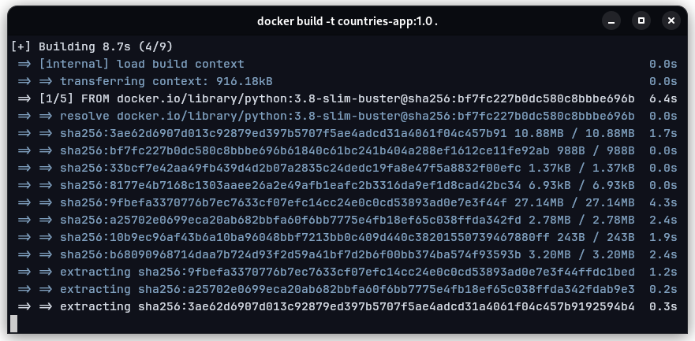
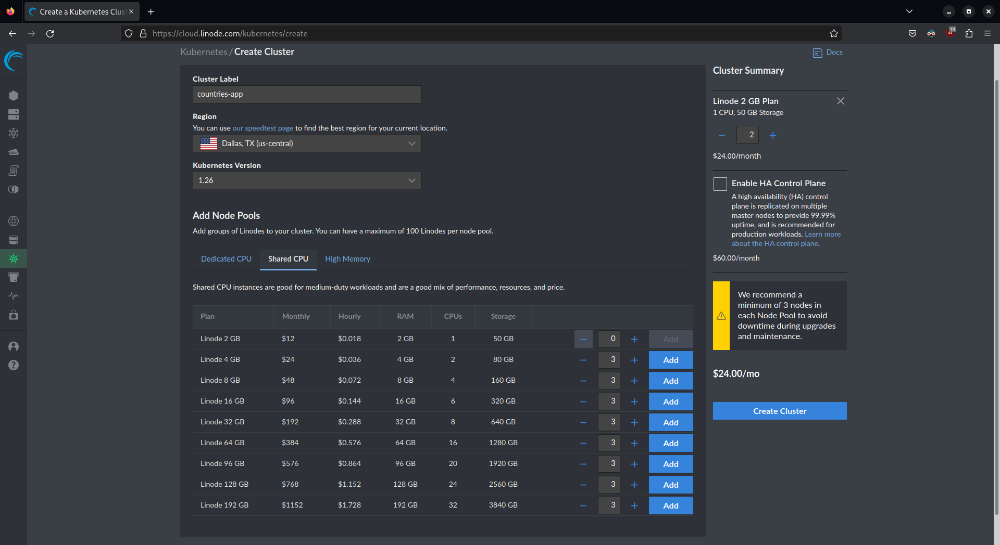
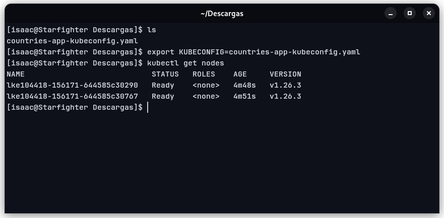
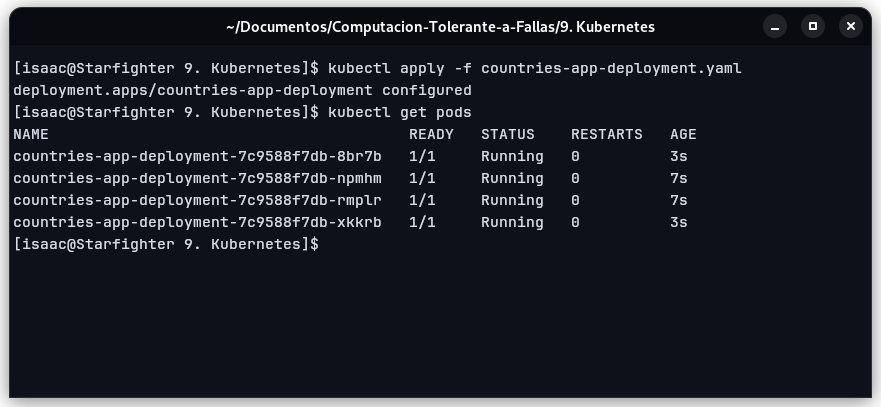
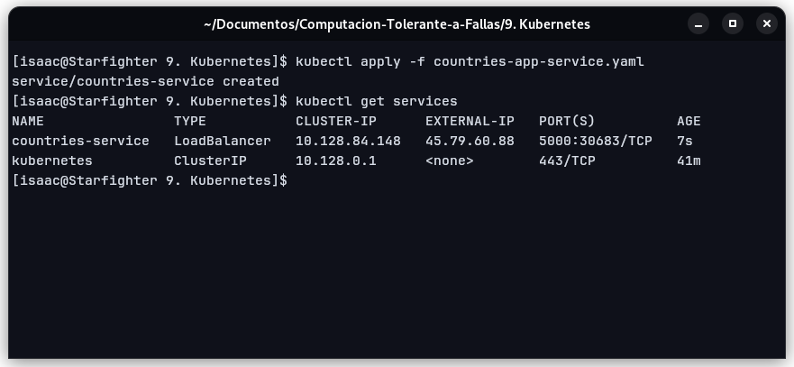
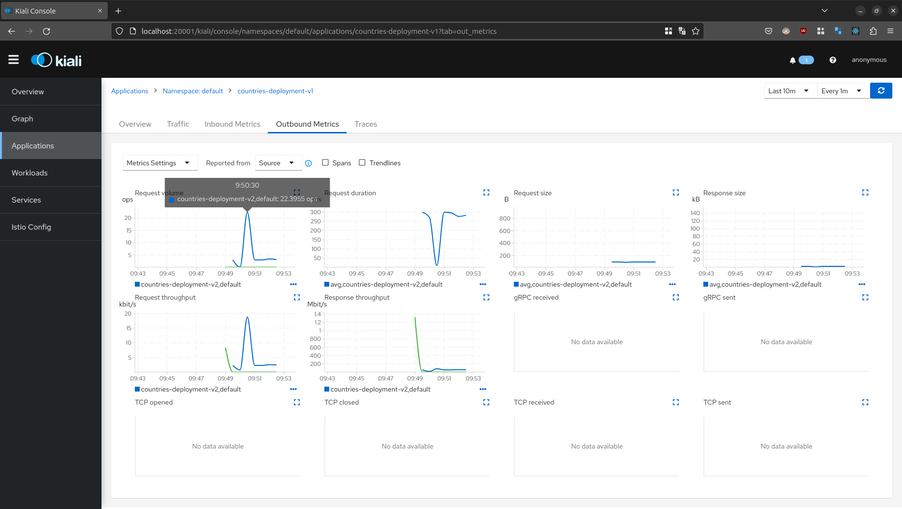

# Service Mesh - Istio
## **Universidad de Guadalajara** - Centro Universitario de Ciencias Exactas e Ingenierias

### Este es un proyecto realizado para la materia de Computación Tolerante a Fallas - D06

**Alumno:** Benavides Hernandez Isaac Alain

---
## Introducción
La arquitectura de microservicios es una arquitectura de software muy utilizada en la industria debido a los beneficios que agrega a un servicio grande, el cúal, por sencilleza tanto de desarrollo como de mantenimiento, es mejor dividirlo en pequeñas partes para aislar problemas y posibles modificaciones, de esta manera no es necesario modificar todo el servicio al mismo tiempo, si no que se inhabilita temporalmente solo lo que se requiere. A pesar de que agrega muchas cosas buenas a nuestra aplicación, el administrar estos microservicios, monitorearlos y aplicar configuraciones de seguridad es muy dificil, en especial si se tienen muchas replicas de estos servicios para ofrecer redundancia y disponibilidad. En esta practica utilizaremos una Malla de Servicios (Istio) para agregar más funcionalidades y herramientas a nuestros deploys hechos en Kubernetes.

---
## Preguntas
### ¿Qué es Istio?
Istio es una malla de servicios que ofrece herramientas independientes de lenguajes de programación para automatizar las funciones de una red de servicio de una aplicación. Nos ayuda a integrar herramientas para registrar las transferencias de datos, añadir telemetria o incluir politicas de acceso a nuestros servicios en Kubernetes.

---
## Contenido

Para esta practica se desarrolló una aplicación web sencilla en Flask donde se obtienen los datos de un país a través de una API pública, se grafican estos datos y se muestran al usuario. El código es el siguiente:

~~~python
from flask import Flask, render_template, request
import requests
import json

app = Flask(__name__)

@app.route('/<nombre_pais>')
def index(nombre_pais):
    url = 'https://restcountries.com/v3.1/name/'
    url_pais = url + nombre_pais
    response = requests.get(url_pais)
    data = json.loads(response.text)

    country = {
        'name': data[0]['name']['common'],
        'oficial_name': data[0]['name']['official'],
        'continent': data[0]['region'],
        'capital': data[0]['capital'][0],
        'population': data[0]['population'],
        'flag': data[0]['flags']['png']
    }

    return render_template('main.html', country=country)
~~~

Se contenerizo esta aplicación para poderla desplegar usando Kubernetes, sin embargo, para hacer mas sencillo el despliegue, se subió la imagen directamente hacia Docker Hub (https://hub.docker.com/r/isaacbh/countries-app).

Ahora, para desplegar el contenedor con Kubernetes, utilizare un servicio de computo en la nube, por 2 sencillas razones:

1. Es más sencillo desplegar estos servicios administrados que instalar el software en mi equipo.

2. Los orquestadores son herramientas muy utilizadas en computo en la nube, entonces me parece buena idea ganar algo de experiencia en este ambiente.

Utilicé los servicios de Linode.

Cuando creamos nuestro cluster, nos ofrecerá varias opciones para nuestros nodos, como somos humildes, elegiremos los nodos más baratos que podamos contratar.

Una vez confirmada nuestra configuración, nos dara el estatus de nuestros nodos y nos proporcionará un archivo YAML con la configuración para acceder a nuestro nodo maestro de Kubernetes. Descargamos este archivo y lo agregamos al PATH de nuestra computadora, de esta manera kubectl tendrá todo lo necesario para trabajar.

Ya que tenemos configurado kubectl para trabajar con nuestro ambiente en la nube, realizaremos nuestro despliegue utilizando un manifiesto que definiremos en un archivo YAML:

~~~yaml
apiVersion: apps/v1
kind: Deployment
metadata:
  name: countries-app-deployment
  labels:
    app: countriesapp
spec:
  replicas: 4
  selector:
    matchLabels:
      app: countriesapp
  template:
    metadata:
      labels:
        app: countriesapp
    spec:
      containers:
      - name: countriesapp
        image: isaacbh/countries-app:1.0
        ports:
        - containerPort: 5000
~~~

Aplicando la configuración a nuestro cluster utilizando nuestro archivo YAML Kubernetes realizará el trabajo necesario.

Una vez que se tiene listo nuestro despliegue solo falta una cosa para poder acceder a nuestra aplicación web, definir nuestro balanceador de carga para poder acceder a nuestros pods.

~~~yaml
apiVersion: v1
kind: Service
metadata:
  name: countries-service
  annotations:
    service.beta.kubernetes.io/linode-loadbalancer-throttle: "4"
  labels:
    app: countries-service
spec:
  type: LoadBalancer
  ports:
    - name: http
      port: 5000
      targetPort: 5000
  selector:
    app: countriesapp
  sessionAffinity: None
~~~

Aplicaremos la configuración definida en el archivo YAML y Kubernetes se encargará de crear nuestro servicio.

Con esto configurado, ya podremos acceder a nuestra aplicación web a través de la dirección IP que nos muestra el servicio, claro, especificando el puerto 5000 y despues del diagonal el país del que queremos obtener la información.

http://45.79.60.88:5000/mexico

---
## Conclusión
Para finalizar, Kubernetes nos permite tener desplegar, mantener y actualizar el servicio utilizando solo 1 comando, por lo que es, a mi opinion, la herramienta más util existente para el despliegue de las aplicaciones: la capacidad de desplegar una cantidad enorme de replicas de nuestro servicio con un solo comando lo hace imprescindible para equipos de IT, además de que este no es el unico beneficio que nos ofrece, la capacidad de recuperación ante fallos, distribución de carga entre pods, etc. 
