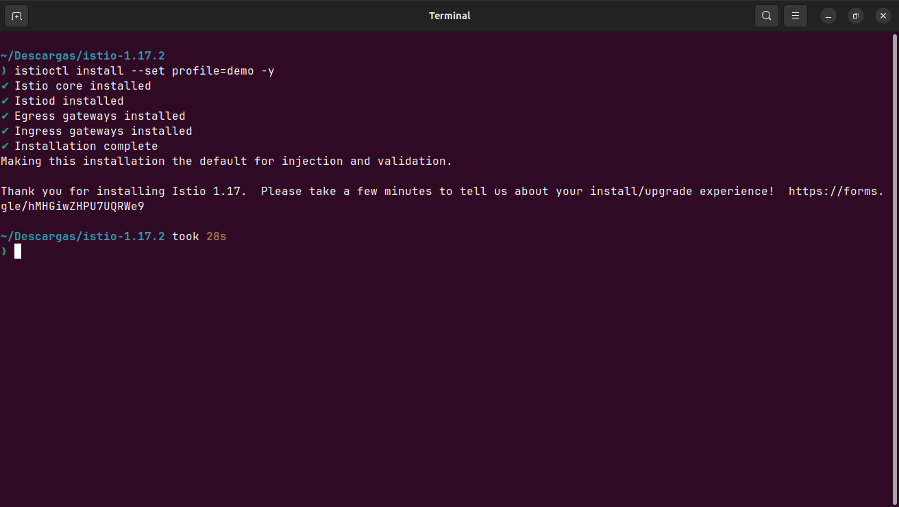
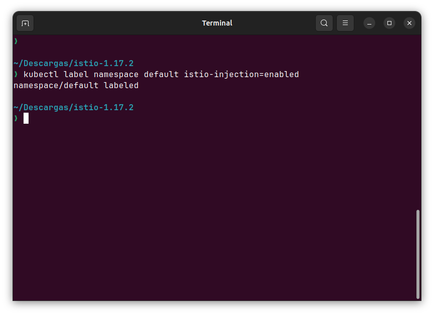
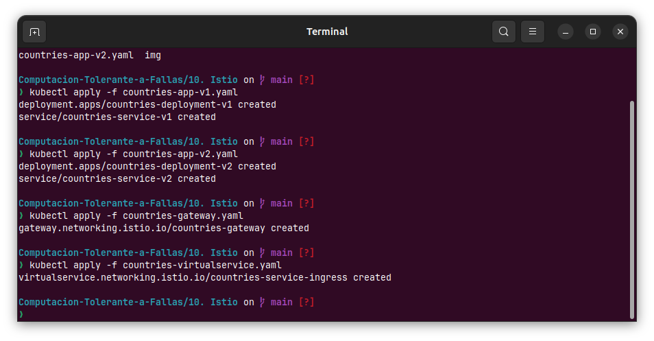
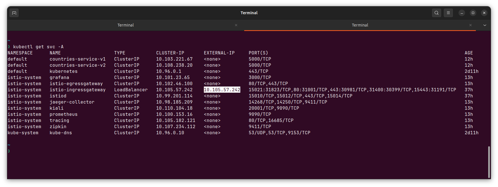
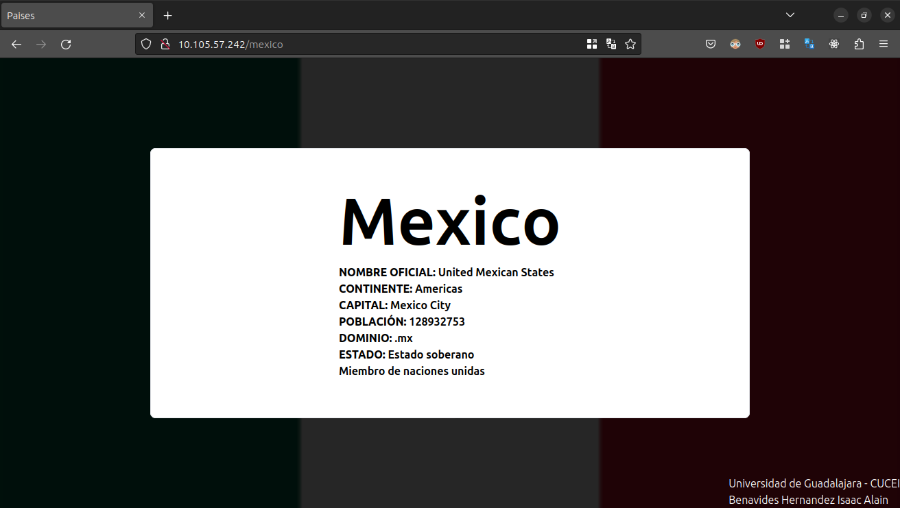
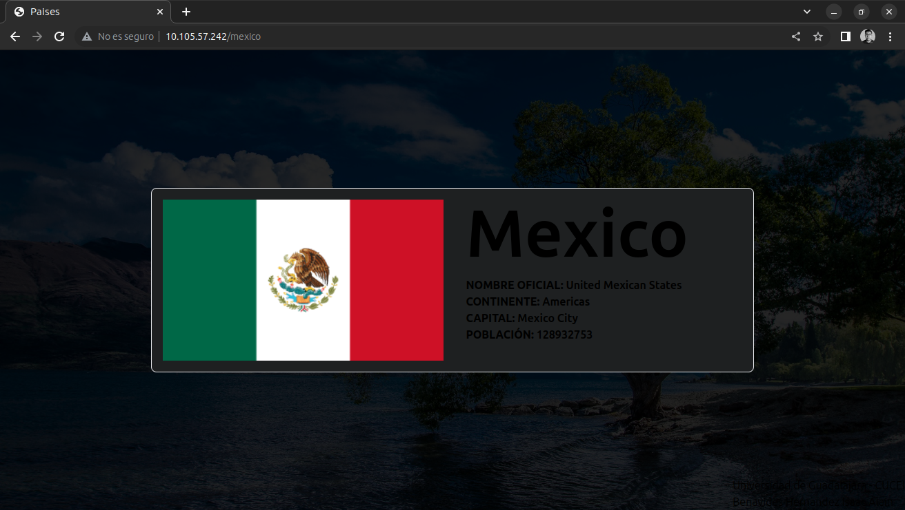
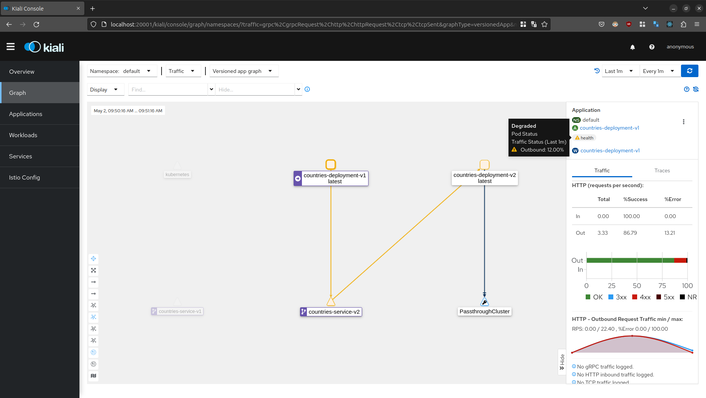

# Service Mesh - Istio
## **Universidad de Guadalajara** - Centro Universitario de Ciencias Exactas e Ingenierias

### Este es un proyecto realizado para la materia de Computación Tolerante a Fallas - D06

**Alumno:** Benavides Hernandez Isaac Alain

---
## Introducción
La arquitectura de microservicios es una arquitectura de software muy utilizada en la industria debido a los beneficios que agrega a un servicio grande, el cúal, por sencilleza tanto de desarrollo como de mantenimiento, es mejor dividirlo en pequeñas partes para aislar problemas y posibles modificaciones, de esta manera no es necesario modificar todo el servicio al mismo tiempo, si no que se inhabilita temporalmente solo lo que se requiere. A pesar de que agrega muchas cosas buenas a nuestra aplicación, el administrar estos microservicios, monitorearlos y aplicar configuraciones de seguridad es muy dificil, en especial si se tienen muchas replicas de estos servicios para ofrecer redundancia y disponibilidad. En esta practica utilizaremos una Malla de Servicios (Istio) para agregar más funcionalidades y herramientas a nuestros deploys hechos en Kubernetes.

---
## Preguntas
### ¿Qué es Istio?
Istio es una malla de servicios que ofrece herramientas independientes de lenguajes de programación para automatizar las funciones de una red de servicio de una aplicación. Nos ayuda a integrar herramientas para registrar las transferencias de datos, añadir telemetria o incluir politicas de acceso a nuestros servicios en Kubernetes.

---
## Contenido
Para esta practica se utilicé la aplicación desarrollada en la practica pasada (9. Kubernetes) y cree una nueva versión de esta aplicación, esto para probar algunas cosas que ofrece Istio.

~~~python
from flask import Flask, render_template, request
import requests
import json

app = Flask(__name__)

# V2 de la aplicacion de paises
@app.route('/<nombre_pais>')
def index(nombre_pais):
    url = 'https://restcountries.com/v3.1/name/'
    url_pais = url + nombre_pais
    response = requests.get(url_pais)
    data = json.loads(response.text)

    country = {
        'name': data[0]['name']['common'],
        'oficial_name': data[0]['name']['official'],
        'continent': data[0]['region'],
        'capital': data[0]['capital'][0],
        'population': data[0]['population'],
        'flag': data[0]['flags']['png'],
        'domain': data[0]['tld'][0],
        'independent': 'Estado soberano' if data[0]['independent'] else "Estado dependiente de otro país",
        'unMember': 'Miembro de naciones unidas' if data[0]['unMember'] else "No es miembro de naciones unidas",
    }

    return render_template('main.html', country=country)
~~~
Al igual que en la practica anterior, este contenedor se encuentra publicado en DockerHub para comodidad al momento de desplegarlo en Kubernetes. En esta vez no se hará un deploy en la nube, si no que se utilizará Minikube para desplegarlo localmente.

---
## Paso 1. Instalar Istio y configurarlo en nuestro Cluster
Para poder desplegar facilmente Istio, podemos utilizar su herramienta de consola, simplemente se descarga el archivo desde su página oficial, y una vez tenemos el ejecutable en nuestro PATH, podemos instalar Istio en nuestro cluster con el siguiente comando: 

~~~bash
istioctl install --set profile=demo
~~~

**Nota:** Al instalar istio con el perfil demo no incluirá todas las herramientas que se verán en este reporte, no incluirá Jaeger, Grafana ni el dashboard web Kiali, estos se necesitan instalar usando kubectl utilizando los manifiestos de ejemplo que vienen incluidos en la carpeta de istioctl. Es decisión de cada quien decidir que tanto instalar, tambien dependerá de que tantos recursos tienes disponibles en tu computadora/cluster, debido a que puedes sobrecargar de servicios que tal vez no termines utilizando.

## Paso 2. Habilitar a istio en todos los deploys de nuestro espacio de trabajo.
Para que nuestros servicios desplegados en Kubernetes puedan utilizar los servicios ofrecidos por Istio, será necesario habilitar la inyección de los contenedores de Istio en cada uno de los pods de nuestro servicio. Esto debido a que Istio funcionará como un proxy, todas las solicitudes que entren a nuestro servicio pasarán primero por Istio y despues, si la configuración lo permite, sera redirigido a nuestra aplicación.

## Paso 3. Crear nuestros deploys, servicios y el gateway de Istio para acceder a los servicios
Ya que Istio esta listo para funcionar en nuestro Cluster, solo resta desplegar nuestras aplicaciones, cabe aclarar, que los servicios de las aplicaciones fueron creados como ClusterIP, por lo que no son accesibles desde fuera del Cluster, por lo que debemos configurar otro servicio para acceder desde fuera de el, en este caso utilizamos un IngressGateway:

~~~yaml
apiVersion: networking.istio.io/v1alpha3
kind: Gateway
metadata:
  name: countries-gateway
spec:
  selector:
    app: istio-ingressgateway
  servers:
  - port:
      number: 80
      name: http
      protocol: HTTP
    hosts:
    - "*"
~~~

Y tambien utilizamos un VirtualService para añadir algunas reglas para acceder a nuestra aplicación, este servicio restringe el acceso a la versión 1 de nuestra aplicación a unicamente los clientes que utilicen Chrome, si utilizan Firefox u otro navegador que no este basado en Chromium será redirigido a la aplicación en su versión 2, el manifiesto es el siguiente:

~~~yaml
apiVersion: networking.istio.io/v1alpha3
kind: VirtualService
metadata:
  name: countries-service-ingress
spec:
  hosts: 
  - '*'
  gateways:
  - countries-gateway
  http:
  - match:
    - headers:
        user-agent:
          regex: .*Chrome.*
    route:
    - destination:
        host: countries-service-v1
  - route:
    - destination:
        host: countries-service-v2
~~~

Cuando ya tenemos todo desplegado, podemos revisar que los servicios sean accesibles, para esto podemos utilizar el comando ``kubectl get svc -A`` y buscamos el servicio que se llame istio-ingressgateway, podremos ver que tiene configurada una IP externa a la que podremos acceder.

Si accedemos desde Mozilla Firefox:

Si accedemos desde Chrome:

## Paso 4. Iniciar el dashboard kiali
Desde una terminal ejecutamos el siguiente comando para iniciar el dashboard web:

~~~bash
istioctl dashboard kiali
~~~

Podremos ver mucha información acerca de las aplicaciones en nuestro cluster, grafos, salud, etc. Para poder visualizar mejor la transferencia de datos entre servicios, simule un intercambio ejecutando el siguiente comando en un contenedor del servicio v1:

~~~bash
while true; do curl http://countries-service-v2:5000/mexico > /dev/null 2>&1; done
~~~

Podemos ver mucha información acerca de los servicios y la transferencia de datos entre ellos, por ejemplo, por varios segundos simule una solicitud correcta y por otros cuantos segundos una solicitud invalida, por lo que se observa que indica que la salud esta degradada. Si abrimos la pestaña de aplicaciones y seleccionamos nuestra aplicación, podremos ver graficos acerca de las metricas y estados de salud de la aplicación.

---
## Conclusión
Para concluir, los servicios desplegados en Kubernetes son increiblemente resilientes a fallos por el simple hecho de estar desplegados en esta plataforma, debido a el posible escalamiento y replicas configuradas, sin embargo, podemos añadir aún más funciones y servicios a estos, como lo hace Istio, la capacidad de añadir un logger, estadisticas, reglas de seguridad y algunas practicas de tolerancia a fallos como las que vimos en la practica de Quarkus hacen a Istio una herramienta muy util y sencilla de acoplar con aplicaciones ya existentes, debido a que no necesitas cambiar nada en código, si no que se inyectan los servicios utilizando contenedores como intermediarios entre el cliente y nuestra aplicación.
