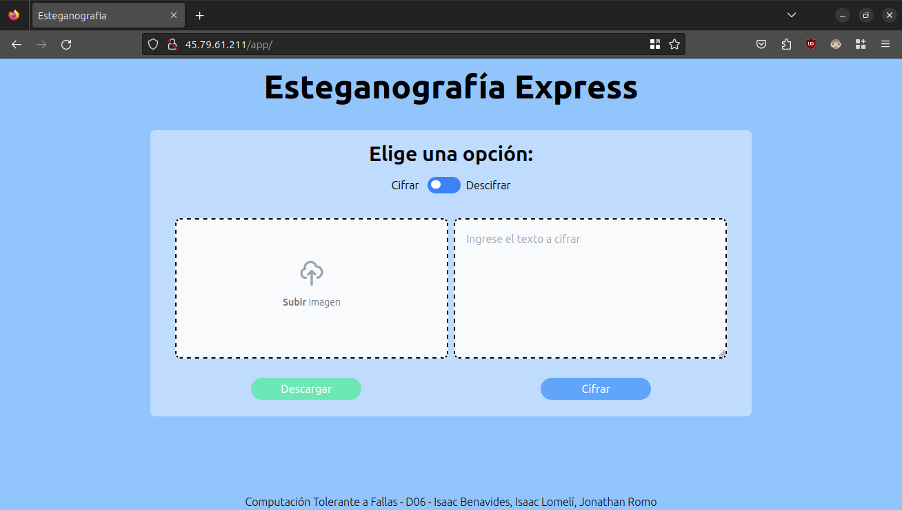

# Cheeky Monkey
## **Universidad de Guadalajara** - Centro Universitario de Ciencias Exactas e Ingenierias

### Este es un proyecto realizado para la materia de Computación Tolerante a Fallas - D06

**Alumno:** Benavides Hernandez Isaac Alain

---
## Introducción
Existen muchas tecnicas para probar como una aplicación actua ante un especifico error o situación, pero estos ultimos años se ha popularizado una tecnica en particular que nos ayuda a ver como una aplicación responde a una emergencia, de esta manera nosotros sabremos si nuestra aplicación es lo suficientemente robusta o necesitamos adaptarla. Esta tecnica es conocida como Chaos Engineering y en esta practica veremos como se utiliza una herramienta que utiliza este principio para probar aplicaciones desplegadas en Kubernetes.

---
## Contenido
Para esta practica utilicé la aplicación desarrollada en el proyecto final https://github.com/isaac-bh/CTF-Proyecto-Final, la cual es una aplicación desarrollada en React y FastAPI, cada servicio tiene 4 replicas desplegadas a lo largo de 4 nodos en la nube, para probarla con Cheeky Monkey, tenemos que instalar el programa de Python en la computadora que administramos nuestro cluster de Kubernetes.

---
## Paso 1. Instalar Versión de Python compatible
Cheeky Monkey utiliza unas dependencias que no han sido actualizadas para nuevas versiones de Python, por lo que es necesario instalar una versión 3.8 o menor de Python para poder ejecutar el programa, en mi caso, utilicé pyenv para gestionar varias versiones de Python al mismo tiempo:

~~~bash
pyenv install 3.8.7
~~~

## Paso 2. Clonar el repositorio de Cheeky Monkey

~~~bash
git clone https://github.com/richstokes/cheekymonkey
cd cheekymonkey
~~~

## Paso 3. Activar el ambiente virtual e instalar las dependencias
Por recomendación, no se debe de instalar las dependencias con acceso a todos los usuarios, por lo que es mejor utilizar un ambiente virtual, si se utiliza pyenv se utiliza el siguiente comando: 

~~~bash
pyenv local 3.8.7
pip install -r requirements.txt
~~~

Si se utiliza una instalación de Python normal:
~~~bash
virtualenv venv
source ./venv/bin/activate
pip install -r requirements.txt
~~~

## Paso 4. Configurar Cheeky Monkey
En la carpeta de Cheeky Monkey existe un archivo llamado constants.py, se pueden editar estas constantes para personalizar la experiencia del juego, en mi caso unicamente editare el tamaño de la ventana del juego.

## Paso 5. Ejecutar Cheeky Monkey
Para que Cheeky Monkey solo utilice los pods del Deploy que hicimos de la app, y no otros servicios de Kubernetes como el DNS-Resolver o el Router, necesitamos especificar que namespaces excluir al ejecutar el programa:

**Nota:** Dependiendo tu instalación y los servicios que hayas instalado, puedes requerir añadir más namespaces.

~~~bash
python cheekymonkey.py --exclude kube-system kube-node-lease kube-public istio-system
~~~

Despues de estar en el juego un rato y destruir muchas cajas, volví a la terminal para verificar el estado de los pods, como se puede observar, todos se han recuperado exitosamente, y se puede ver por el tiempo de ejecución que fueron destruidos hace poco por Cheeky Monkey.

De igual manera, hice una prueba en la que mientras destruia cajas en el Cheeky Monkey e intente cargar el sitio web que esta desplegado, no tuvo problema alguno el servicio.

---
## Conclusión
Para concluir, la ingenieria del caos me parece una solución inovadora para probar los ambientes y que tan resistentes son, deben de existir otras herramientas para esta metodologia pero Cheeky Monkey hace interesante el generar caos en nuestra aplicación y en este caso, Chaos Engineering nos ayudo a probar hasta que punto nuestra aplicación se recupera de fallos, pero esta misma tecnica se puede utilizar para detectar fallos, lo cual nos ayudara a mejorar nuestra aplicación.
