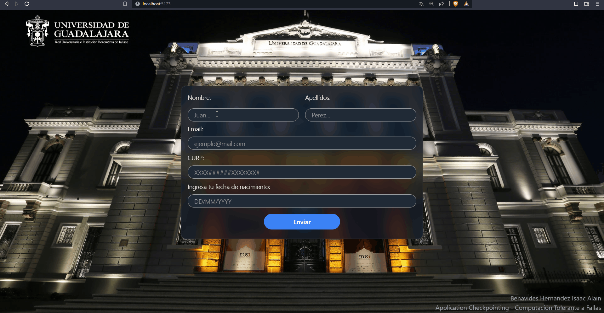

# Application Checkpointing
## **Universidad de Guadalajara** - Centro Universitario de Ciencias Exactas e Ingenierias

### Este es un proyecto realizado para la materia de Computación Tolerante a Fallas

**Alumno:** Benavides Hernandez Isaac Alain

---
## Contenido

Este programa realiza 'copias de seguridad' de todo lo que un usuario escribe en un formulario en una página web. Esto se realiza gracias a que cada vez que una etiqueta input recibe un cambio, este cambio se guarda en el local storage del usuario utilizando la siguiente función:

~~~JavaScript
const handleChange = (event) => {
    event.preventDefault();
    setDatos({
        ...datos,
        [event.target.name]: event.target.value
    });
    localStorage.setItem(event.target.name, event.target.value);
}
~~~

Para recuperar la 'copia de seguridad' de lo que el usuario ingresa en el formulario se utiliza el hook ``useEffect`` de React, esta función se invoca una sola vez cuando el componente App es renderizado. El código para recuperar es el siguiente:

~~~JavaScript
useEffect(() => {
    setDatos({
        nombre: localStorage.getItem("nombre"),
        apellidos: localStorage.getItem("apellidos"),
        mail: localStorage.getItem("mail"),
        curp: localStorage.getItem("curp"),
        fechaN: localStorage.getItem("fechaN"),
    });
}, [])
~~~

---
## Comparación
### Con Checkpointing:

### Sin Checkpointing:

---
## Instalación
Si se desea ejecutar el código de manera local, tendrá que seguir los siguientes pasos:
1. Instalar node.js

2. Clonar el repositorio
    ~~~bash
    git clone https://github.com/isaac-bh/Application-Checkpointing
    ~~~

3. Entrar a la carpeta del proyecto
    ~~~bash
    cd Application-Checkpointing
    ~~~

4. Instalar las dependencias
    ~~~bash
    npm install
    ~~~

5. Ejecutar el entorno de desarrollo
    ~~~bash
    npm run dev
    ~~~