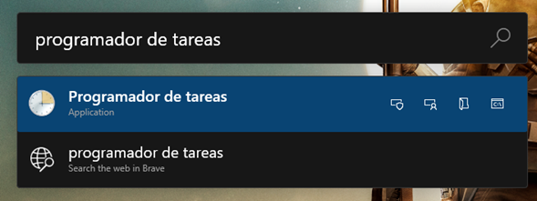
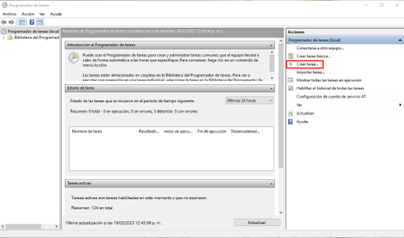
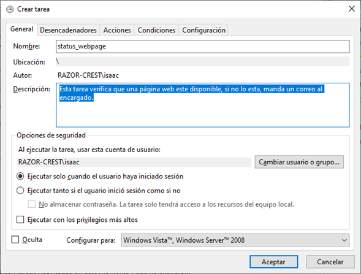
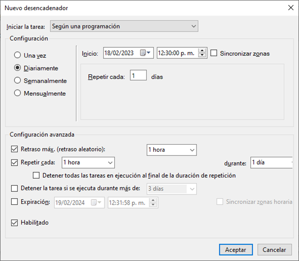
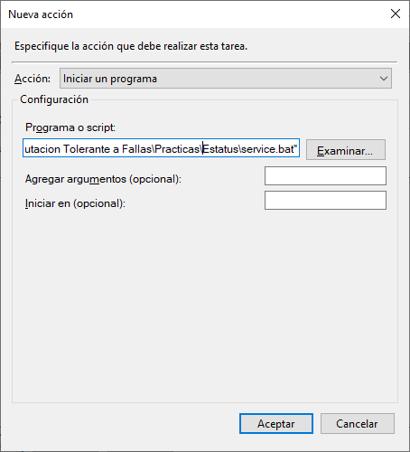
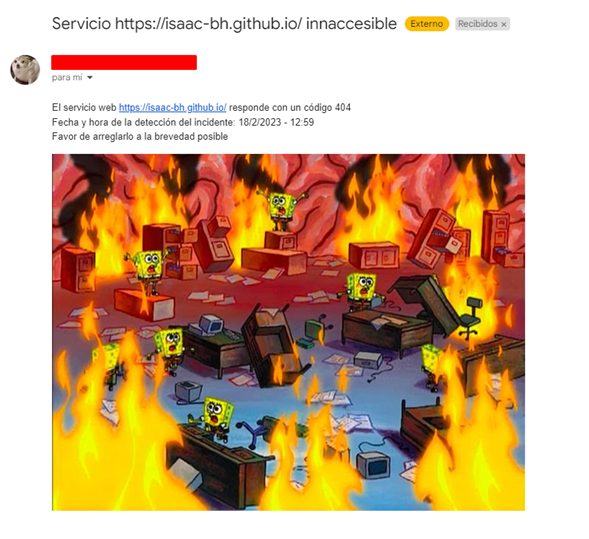

# Estatus
## **Universidad de Guadalajara** - Centro Universitario de Ciencias Exactas e Ingenierias

### Este es un proyecto realizado para la materia de Computación Tolerante a Fallas

**Alumno:** Benavides Hernandez Isaac Alain

---
## Contenido

Este programa verifica que un servicio web este disponible, realizando una simple petición HTTP, dependiendo del código de respuesta sabemos si el servicio esta trabajando bien o tiene una falla. El código para detectar si el servicio esta disponible es el siguiente:

~~~python
URL = "https://isaac-bh.github.com/"

"""
Codigo intermedio
"""

def main():
    # Petición HTTP, código entre 200 y 299 = Ok
    response = requests.get(URL)
    if not (response.status_code >= 200 and response.status_code <= 299):
        send_mail(response.status_code, time.localtime())
~~~

Como se logra ver, el código envia un correo al que deberia de ser el responsable del servicio para que se le notifique de inmediato. El código para enviar el correo es el siguiente:

~~~python
def send_mail(status_code, timestmp):
    # Esta parte debe de ser configurada por cada usuario.
    email_from = "ejemplo@mail.com"
    password = "CONTRASEÑA_SUPER_SECRETA123"
    smtp_server = "smtp.gmail.com"
    smtp_port = 587
    email_to = "destinatario@mail.com"

    # Datos del mail a enviar
    msg = MIMEMultipart()
    msg["Subject"] = str("Servicio " + URL + " innaccesible")
    msg["From"] = email_from
    msg["To"] = email_to
    body = f"""\
    <html>
    <body>
        
El servicio web {URL} responde con un código {status_code} 
        Fecha y hora de la detección del incidente: {timestmp.tm_mday}/{timestmp.tm_mon}/{timestmp.tm_year} -
        {timestmp.tm_hour}:{timestmp.tm_min} 
        Favor de arreglarlo a la brevedad posible

        
    </body>
    </html>
    """
    msg.attach(MIMEText(body, "html"))

    # Se inicia una conexión segura con el servidor SMTP, se inicia sesión, 
    # se envia el mail y se cierra la conexión.
    server = smtplib.SMTP(smtp_server, smtp_port)
    server.starttls()
    server.login(email_from, password)
    server.sendmail(email_from, email_to, msg.as_string())
    server.quit()
~~~
Como se observa, se deben de configurar varias cosas antes de ejecutar este programa, como la dirección de destino, de origen, la contraseña del mail de origen y los datos del servidor SMTP, en este caso se utiliza el servicio de Gmail.

## Crear servicio.
Para que este programa tenga más utilidad, lo ideal es que se programe como un servicio que una computadora ejecuta automaticamente. En Windows se puede realizar de la siguiente forma:

1. Iniciar el programador de tareas.

    

2. Iniciar el modo "Crear tarea".

    

3. Nombrar la tarea y darle una descripción.

    

4. Cambiar a la pestaña "Desencadenadores" y añadir un nuevo desencadenador.

    

5. Modificar los tiempos de acuerdo a el tiempo que se necesitará que se ejecute el programa. En este caso se repite cada hora la tarea. Una vez hecho damos click en "Aceptar"

    
6. Cambiamos a la pestaña de "Acciones" y damos click en Nueva.

    

7. En la ventana emergente seleccionamos el tipo de acción que se ejecutará, en este caso se iniciará un programa y se seleccionará el archivo ``.bat`` que se encuentra en el repositorio. Dar click en aceptar
    
    **Nota importante: es necesario que se configure el archivo .bat previamente, ya que se necesita poner la ruta absoluta del interprete de python y la ruta absoluta del archivo main.py de este repositorio** 

    

8. Una vez configurado todo lo anterior damos click en aceptar y podremos ver en el programador de tareas que nuestra tarea se ha creado, ahora cada hora verificará que el servicio web puesto en la variable ``URL`` de nuestro archivo ``main.py`` este funcionando.

    

---
## Instalación
Para ejecutar el código tendrá que seguir los siguientes pasos:
1. Instalar Python

2. Clonar el repositorio
    ~~~bash
    git clone https://github.com/isaac-bh/Computacion-Tolerante-a-Fallas
    ~~~

3. Entrar a la carpeta del proyecto
    ~~~bash
    cd Computacion-Tolerante-a-Fallas/Estatus/
    ~~~

4. Instalar las dependencias
    ~~~bash
    pip install -r requirements.txt
    ~~~

5. Configurar la URL de la que se estará verificando y añadir las cuentas de correo en el código del archivo ``main.py``

6. Ejecutar el script
    ~~~bash
    python main.py
    ~~~