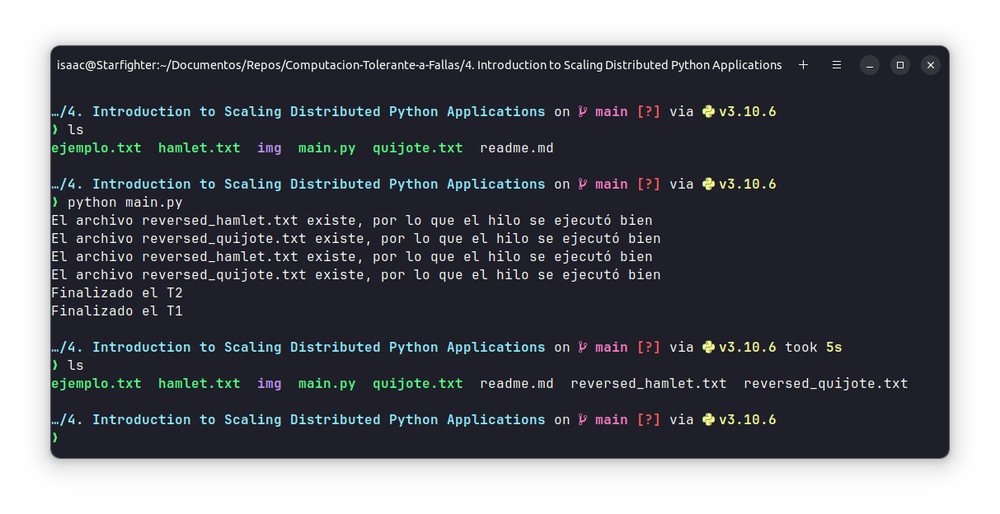
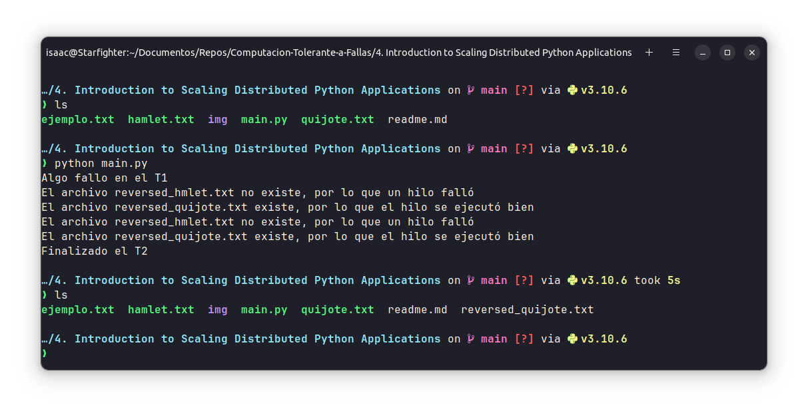

# An Introduction to Scaling Distributed Python Applications
## **Universidad de Guadalajara** - Centro Universitario de Ciencias Exactas e Ingenierias

### Este es un proyecto realizado para la materia de Computación Tolerante a Fallas - D06

**Alumno:** Benavides Hernandez Isaac Alain

---
## Introducción
Las aplicaciones distribuidas estan diseñadas para que un programa pueda ser robusto, redundante y con más poder de computo del que se podria tener en una sola computadora o servidor. Sin embargo, en la siguiente práctica se observará como podemos utilizar los hilos para ofrecer un servicio redundante en una misma computadora sin necesidad de otras herramientas.

---
## Contenido

Este programa simula un proceso de servidor que puede fallar, se toman dos archivos de texto y se invierte el contenido de estos simultaneamente utilizando hilos, el código es el siguiente

~~~python
import threading
import time
from os import path

def monitoreo(paths):
    while True:
        for file in paths:
            reversed_path = 'reversed_' + file
            if path.exists(reversed_path):
                print(f"El archivo {reversed_path} existe, por lo que el hilo se ejecutó bien")
            else:
                print(f"El archivo {reversed_path} no existe, por lo que un hilo falló")

        time.sleep(3)

def invert_file(file_path: str, thread):
    try:
        file = open(file_path, 'r')
        lines = list(file)
        file.close()

        lines[-1] += '\n' 
        
        new_file = 'reversed_' + file_path
        file = open(new_file, 'w')
        for line in reversed(lines):
            file.write(line)

        file.close()
        time.sleep(5)
        print(f"Finalizado el {thread}")
    except:
        print(f"Algo fallo en el {thread}")

def main():
    hilos = []
    paths = ['hamlet.txt', 'quijote.txt']
    MAX_THREADS = len(paths)

    for i in range(MAX_THREADS):
        t = 'T' + str(i + 1)
        hilo = threading.Thread(target=invert_file, args=(paths[i], t))
        hilos.append(hilo)

    for hilo in hilos:
        hilo.start()

    monitor = threading.Thread(target=monitoreo, args=(paths,))
    monitor.daemon = True
    time.sleep(1)
    monitor.start()

if __name__ == '__main__':
    main()
~~~

Ahora, si ejecutamos el programa, podremos ver que los archivos ``reversed`` fueron creados paralelamente y el mismo programa nos lo indica utilizando el tercer hilo que corré en modo Deamon, el cual se utiliza solo para monitorear los otros dos hilos. Se observa que el monitoreo se ejecuta 2 veces, esto es por que el Daemon esta en un bucle infinito y espera 3 segundos para volver a ejecutarse, esto hasta que todos los otros hilos terminen.

Y si llegá a ocurrir un error en la ejecución de uno de los hilos, el otro hilo se ejecutará sin problemas, por lo que al menos tendremos disponible nuestro proceso/servicio aún disponible. El hilo daemon nos notificará que algo falló en uno de los hilos debido a que no pudo encontrar uno de los archivos ``reversed``.

---
## Instalación
Para ejecutar el código tendrá que seguir los siguientes pasos:
1. Instalar Python

2. Clonar el repositorio
    ~~~bash
    git clone https://github.com/isaac-bh/Computacion-Tolerante-a-Fallas
    ~~~

3. Entrar a la carpeta del proyecto
    ~~~bash
    cd 'Computacion-Tolerante-a-Fallas/4. Introduction to Scaling Distributed Python Applications'
    ~~~

4. Ejecutar el script
    ~~~bash
    python main.py
    ~~~

--- 
## Conclusión
Para concluir, los hilos y el paralelismo en general son tecnicas muy poderosas para realizar programas robustos, yo pensaba que estos servian unicamente para dividir un trabajo pesado entre varios nucleos del procesador, sin embargo, esta practica me ayudó a entender otro uso del paralelismo, la tolerancia a fallas, me parece un buen uso de los hilos para que si un proceso fallá, los demás sigan funcionando sin problema alguno, además de que tener un proceso en modo daemon corriendo de fondo y monitoreando, resulta util, ya que podemos detectar si un hilo falló y notificar al encargado, o incluso intentar recuperar la ejecución de ese hilo. 