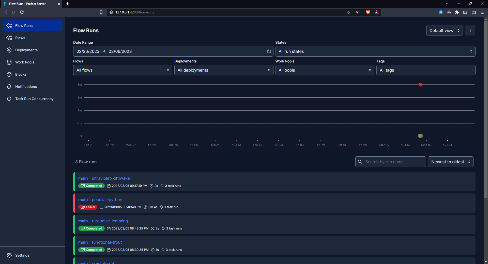
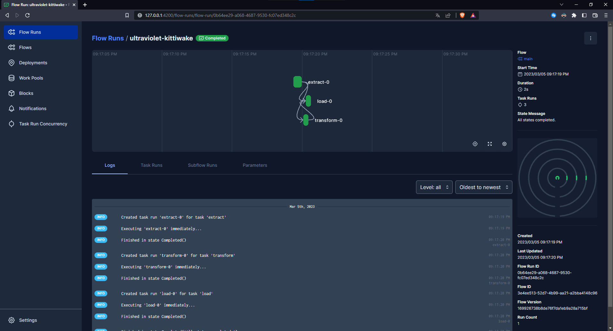
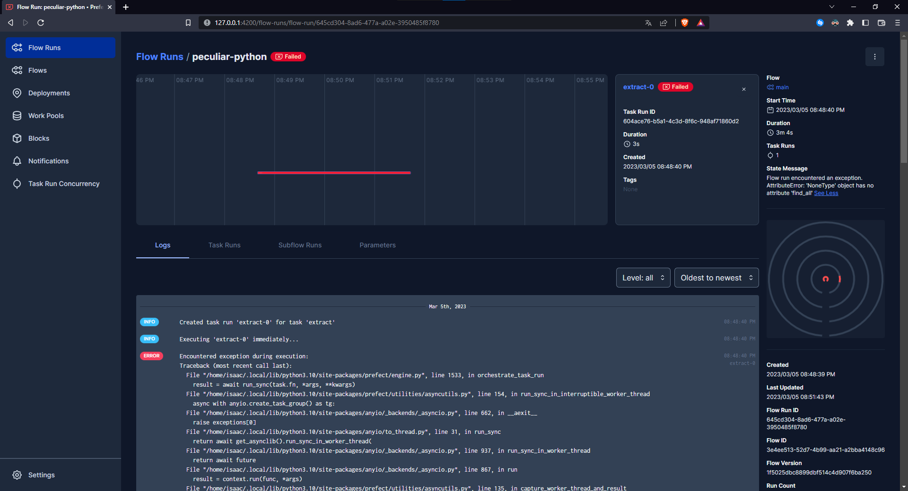

# Workflow Managers
## **Universidad de Guadalajara** - Centro Universitario de Ciencias Exactas e Ingenierias

### Este es un proyecto realizado para la materia de Computación Tolerante a Fallas - D06

**Alumno:** Benavides Hernandez Isaac Alain

---
## Introducción
Los Workflow Managers son herramientas diseñadas especificamente para almacenar, programar y observar los resultados de ejecución de nuestros programas. Los WorkFlow Managers son especialmente utiles en el campo de la Ciencia de Datos o en el campo del BigData, ya que nos permiten ver como va el flujo de trabajo y nos permite visualizar las dependencias entre tareas. Es una excelente herramienta para Debug y Monitoreo de aplicaciones grandes, por lo que en esta practica se muestra una implementación sencilla para entender como se utiliza y los beneficios que nos ofrece en la tolerancia a fallas.

---
## Contenido

Este programa obtiene el precio del dolar desde internet, utilizando este dato calcula el valor en pesos mexicanos de un producto del cual se tiene su precio en dolares para al final guardar estos datos, junto con la fecha en un archivo de texto. Esto para cumplir con las etapas del proceso ETL (Extract, Transform, Load).

Primero deifinimos nuestras tareas:

~~~python
import requests
from bs4 import BeautifulSoup
from datetime import date
from prefect import task, flow


@task(retries=3, retry_delay_seconds=60)
def extract():
    url = 'https://www.banxico.org.mx/tipcamb/tipCamMIAction.do'
    response = requests.get(url)

    soup = BeautifulSoup(response.content, 'html.parser')
    renglon = soup.find('tr', {'class': 'renglonNon'})
    tds = renglon.find_all('td')

    return float(tds[-1].text.strip())


@task
def transform(dolar):
    # Precio de la Steam Deck xd
    steam_deck = 399.00
    return dolar * steam_deck


@task
def load(steam_deck_mxn, dolar, file):
    hoy = date.today()
    fecha_formateada = hoy.strftime("%d/%m/%Y")
    msg = str(fecha_formateada) + ' - Dolar a ' + str(dolar) + 'MXN, total de ' + str(steam_deck_mxn) + 'MXN por una Steam Deck.\n'
    with open(file, 'a') as f:
        f.write(msg)

    return msg
~~~

Y para que podamos ver estas tareas a travez de Prefect, necesitamos definir un Flow de trabajo

~~~python
@flow
def main():
    dolar = extract()
    steam_deck_mxn = transform(dolar)
    result = load(steam_deck_mxn, dolar, 'track.txt')
    print(result)

main()
~~~

Una vez que tenemos nuestro código listo, ejecutamos el siguiente comando en la terminal para iniciar el servidor de Prefect:
```bash
prefect server start
```


## Ejecución del programa.
El programa esta listo para ejecutarse y almacenar los resultados en Prefect, por lo que ahora simplemente se ejecuta como un script de Python, claro, invocando la función que definimos como Flow con el decorador.
```bash
python main.py
```


Si vamos a la interfaz web de Prefect (localhost:4200), podremos ver las diferentes veces que se ha ejecutado el programa.


Si damos click en una de los ejecuciones nos mostrará los detalles, si termino con exito nos mostrará los detalles del flujo de los datos a través de las funciones.


O nos mostrará los errores que se tuvieron al momento de ejecutar el script de Python.



---
## Instalación
Para ejecutar el código tendrá que seguir los siguientes pasos:
1. Instalar Python

2. Clonar el repositorio
    ~~~bash
    git clone https://github.com/isaac-bh/Computacion-Tolerante-a-Fallas
    ~~~

3. Entrar a la carpeta del proyecto
    ~~~bash
    cd 'Computacion-Tolerante-a-Fallas/5. Workflow Managers/'
    ~~~

4. Instalar las dependencias
    ~~~bash
    pip install -r requirements.txt
    ~~~

5. Iniciar Prefect
    ~~~bash
    prefect server start
    ~~~

6. Abrir en el navegador la interfaz web de Prefect
    ~~~bash
    localhost:4200
    ~~~

7. Ejecutar el script
    ~~~bash
    python main.py
    ~~~

--- 
## Conclusión
Para finalizar, Prefect, o en general los Workflow Managers son herramientas muy poderosas que a mi opinión se asemejan a los loggers con muchas otras funcionalidades, sin embargo, estos vienen por defecto listos para trabajar, no se necesita modificar mucho el código base para poder implementar Prefect, a diferencia de los loggers. Creo que es una herramienta muy util para monitorear sistemas criticos, o sistemas donde se procese muchisima información, pero para proyectos sencillos me parece una exageración utilizar un Workflow Manager.