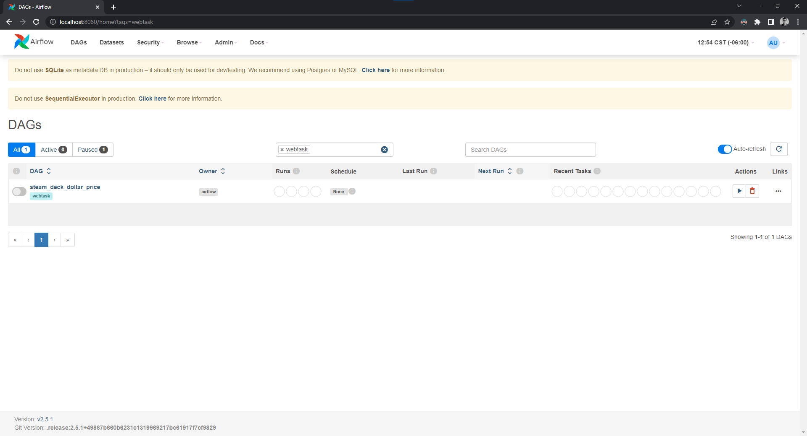
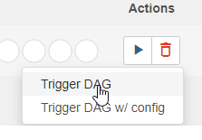
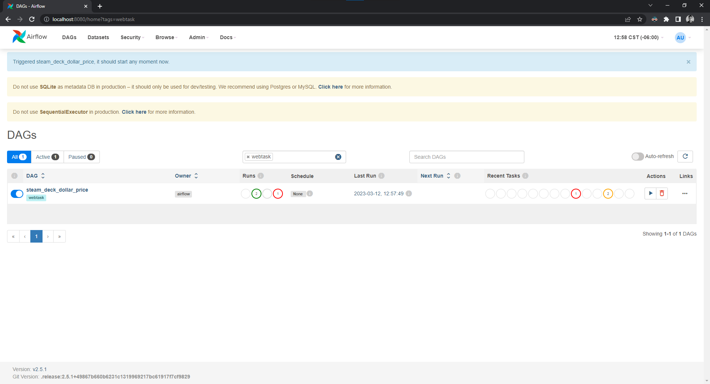
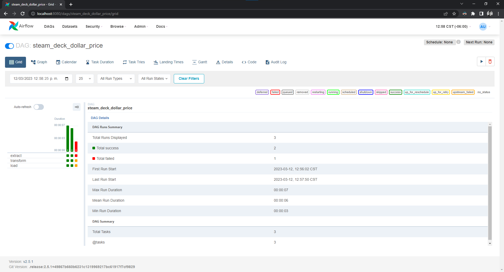
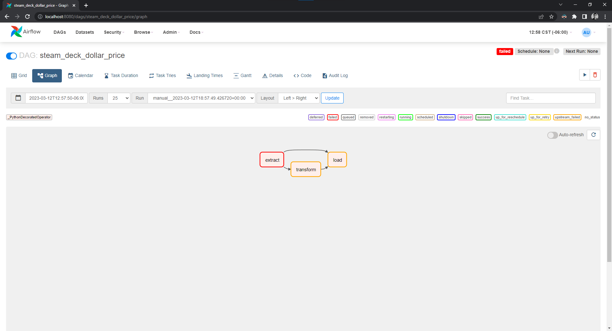
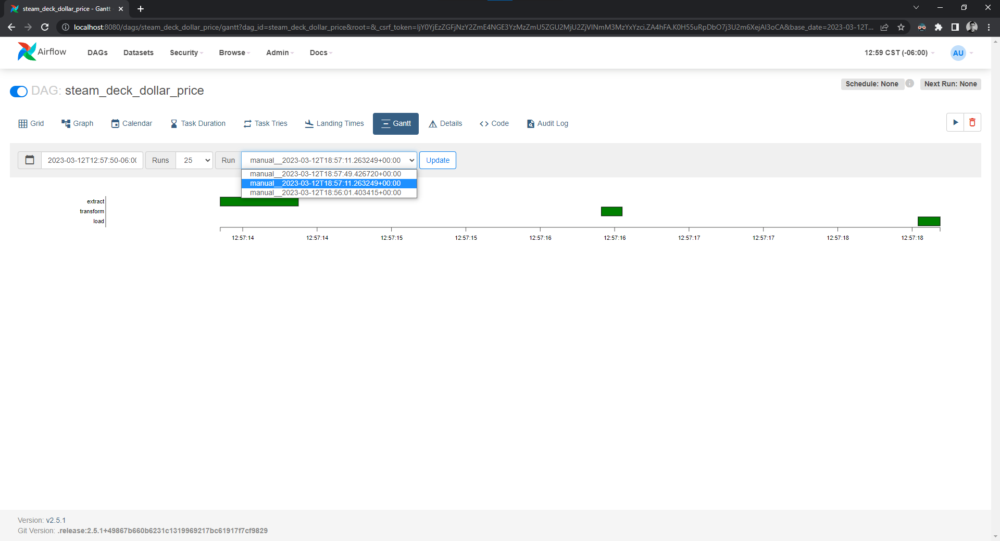

# Airflow
## **Universidad de Guadalajara** - Centro Universitario de Ciencias Exactas e Ingenierias

### Este es un proyecto realizado para la materia de Computación Tolerante a Fallas - D06

**Alumno:** Benavides Hernandez Isaac Alain

---
## Introducción
En el mundo de la tecnologia y el desarrollo, es recomendable probar diferentes tecnologias sin importar si dos de ellas realizan la misma tarea o cumplen el mismo objetivo, esto nos ofrecerá una perspectiva más amplia de los problemas que necesitamos solucionar y cúal es la mejor manera de solucionarlo. En esta práctica se pondrá a prueba el Workflow Manager Apache Airflow, que a pesar de tiene el mismo proposito que la herramienta Prefect de la práctica pasada, esta tecnologia ofrece otras herramientas y su forma de trabajar es diferente a la de Prefect. Todo esto para que podamos tener una idea clara de sus diferencias y ventajas de cada herramienta.

---
## Contenido

Este programa es una adaptación del programa anterior de la práctica ``5. Workflow Managers`` pero ahora utilizando la herramienta Apache Airflow, este programa obtiene el valor actual del dolar en la página de Banxico y convierte el valor de la Steam Deck ($399 USD) en Pesos Mexicanos, para despues guardar en un archivo un registro del dia, el valor del dolar y el total del Steam Deck en MXN. 

A diferencia de Prefect, Airflow no necesita separar el flujo de trabajo de las tareas, si no que se utiliza una función que se declara como el flujo y dentro de esta se definen las tareas:

~~~python
from airflow.decorators import dag, task
import requests
from bs4 import BeautifulSoup
from datetime import date
import pendulum


@dag(
    schedule=None,
    start_date=pendulum.datetime(2023, 3, 12, tz="UTC"),
    tags=["webtask"],
)
def steam_deck_dollar_price():
    @task()
    def extract():
        url = 'https://www.banxico.org.mx/tipcamb/tipCamMIAction.do'
        response = requests.get(url)

        soup = BeautifulSoup(response.content, 'html.parser')
        renglon = soup.find('tr', {'class': 'renglonNon'})
        tds = renglon.find_all('td')

        return float(tds[-1].text.strip())
    

    @task()
    def transform(dolar):
        # Precio de la Steam Deck xd
        steam_deck = 399.00
        return dolar * steam_deck
    

    @task()
    def load(steam_deck_mxn, dolar, file):
        hoy = date.today()
        fecha_formateada = hoy.strftime("%d/%m/%Y")
        msg = str(fecha_formateada) + ' - Dolar a ' + str(dolar) + 'MXN, total de ' + str(steam_deck_mxn) + 'MXN por una Steam Deck.\n'
        with open(file, 'a') as f:
            f.write(msg)

        return msg

    
    dolar = extract()
    steam_deck_mxn = transform(dolar)
    result = load(steam_deck_mxn, dolar, 'track.txt')
    print(result)


steam_deck_dollar_price()
~~~


Es necesario llamar a la función que definimos como nuestro flujo de trabajo dentro del código, una vez que todo esto esta hecho, necesitamos que Airflow identifique nuestro archivo .py. Sin embargo, esto no es tan sencillo como Prefect, por lo que seguiremos el siguiente proceso:

**ES NECESARIO TENER INSTALADO APACHE AIRFLOW ANTES DE REALIZAR ESTO, POR LO QUE SE RECOMIENDA SEGUIR LOS  [PASOS DE INSTALACION](#instalación) ANTES.**

1. 
    ```bash
    mkdir ~/airflow/dags
    ```

2. 
    ```bash
    cp main.py ~/airflow/dags/
    ```

3. 
    ```bash
    airflow standalone
    ```

Una vez hecho esto, podemos dirigirnos al sitio web (localhost:8080) con las credenciales que el comando del paso 3 arroja, veremos muchos DAGs que vienen de ejemplo, pero podemos filtrar por etiquetas, nuestro programa le pusimos una etiqueta ``webtask`` por lo que filtraremos por eso.



Si damos click en el simbolo de Play, podremos ejecutar nuestro DAG. No es necesaria la configuración para este ejemplo.



En la misma página nos mostrará un resumen de las ejecuciones anteriores y un resumen de la ejecución anterior. En este caso fue ejecutado varias veces y en una de ellas se provocó un error.



Si abrimos el DAG, nos dará mucha información acerca de la ejecución, podemos ver varias cosas como un resumen, grafos, diagramas de gantt con los tiempos de ejecución, y se puede seleccionar cualquiera de las veces que se ejecutó el programa.








---
## Instalación
Para ejecutar el código tendrá que seguir los siguientes pasos:
1. Instalar Python, versión 3.10 o inferior

2. Clonar el repositorio
    ~~~bash
    git clone https://github.com/isaac-bh/Computacion-Tolerante-a-Fallas
    ~~~

3. Entrar a la carpeta del proyecto
    ~~~bash
    cd 'Computacion-Tolerante-a-Fallas/6. Airflow/'
    ~~~

4. Instalar las dependencias
    ~~~bash
    pip install -r requirements.txt
    ~~~

--- 
## Conclusión
Para concluir, Apache Airflow es una herramienta, que en mi opinión, es más completa que Prefect y que tal vez en un ambito profesional estas dos pueden tener un diferente publico objetivo, pero para estos ejemplos sencillos que realizamos, puedo decir que Prefect es mucho más facil de utilizar e inicializar, sin embargo, Airflow ofrece más información de las ejecuciones de los programas, ademas de que ofrece esta información en una manera más sencilla utilizando graficas y resumenes rapidos en la vista general de DAGs. Cada herramienta tiene sus ventajas y sus desventajas, y es bueno que conozcamos ambas, de esta manera si lo requerimos, podremos decidir cual de estas herramientas se ajusta más a nuestra situación.

---

## Bibliografia
Working with TaskFlow — Airflow Documentation. (s. f.). https://airflow.apache.org/docs/apache-airflow/stable/tutorial/taskflow.html