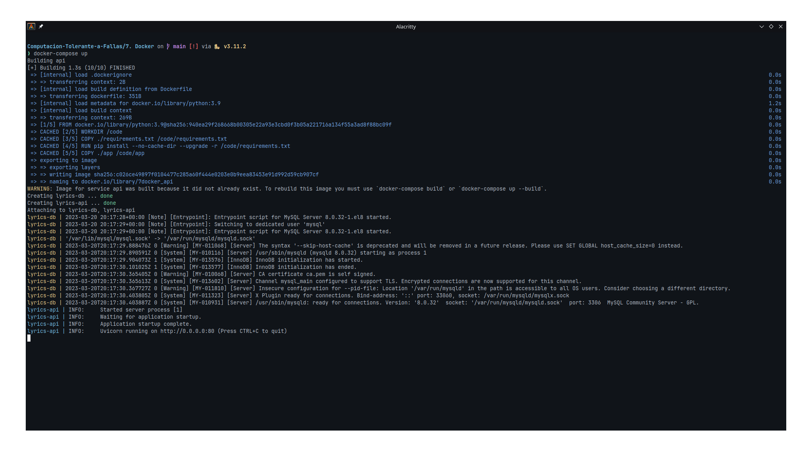
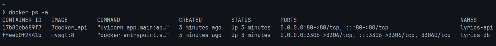
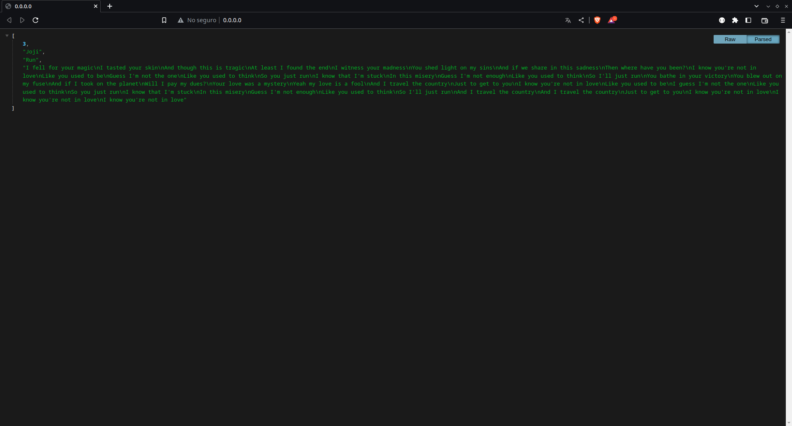

# Docker
## **Universidad de Guadalajara** - Centro Universitario de Ciencias Exactas e Ingenierias

### Este es un proyecto realizado para la materia de Computación Tolerante a Fallas - D06

**Alumno:** Benavides Hernandez Isaac Alain

---
## Introducción
En entornos de desarrollo donde muchos programadores trabajan al mismo tiempo es muy probable que cada integrante del proyecto pase mucho tiempo configurando el proyecto para que este pueda ser ejecutado en su maquina. Existen varios metodos para solucionar esta problematica, sin embargo, la más conocida actualmente son los contenedores. Los contenedores son ambientes que incluyen todas las dependencias y herramientas necesarias para correr una aplicación, estos estan totalmente aislados del resto de la computadora por lo que se podria decir que son ambientes portables para aplicaciones. En la siguiente practica utilizaremos los contenedores para ejecutar un servicio web.

---
## Contenido

Este programa es una API REST realizada con el framework FastAPI y utilizando MySQL. Este programa consulta los registros de la base de datos ordenandolos de manera aleatoria y devolviendo el primer resultado cada vez que se solicite la página principal.

~~~python
from fastapi import FastAPI
import mysql.connector

app = FastAPI()

mydb = mysql.connector.connect(
  host="lyrics-db",
  user="root",
  password="cisco123",
  database="lyrics"
)
mycursor = mydb.cursor(buffered=True)

@app.get("/")
async def root():
    mycursor.execute("SELECT * FROM lyrics ORDER BY RAND()")
    response = mycursor.fetchone()
    return response
~~~

Para poder ejecutar esta aplicación en un contenedor se necesita definir que necesita como prerequisitos y realizar unas configuraciones, todo esto esta definido en nuestro archivo Dockerfile:

~~~docker
FROM python:3.9
WORKDIR /code
COPY ./requirements.txt /code/requirements.txt
RUN pip install --no-cache-dir --upgrade -r /code/requirements.txt
COPY ./app /code/app
CMD ["uvicorn", "app.main:app", "--host", "0.0.0.0", "--port", "80"]
~~~

Podemos construir esta imagen individualmente si tenemos una instancia de MySQL lista, pero como en nuestro caso no es así, aprovecharemos para definir un archivo docker-compose para levantar ambos contenedores al mismo tiempo:

~~~yml
services:
  api:
    depends_on:
      - db
    build:
      context: .
      dockerfile: Dockerfile
    ports:
      - 80:80
    networks:
      - lyrics-network
    container_name: lyrics-api
  db:
    image: mysql:8
    ports:
      - 3306:3306
    volumes:
      - mysql:/var/lib/mysql
    environment:
      - MYSQL_ROOT_PASSWORD=cisco123
    networks:
      - lyrics-network
    container_name: lyrics-db

networks:
  lyrics-network:
    external: true
    name: lyrics-network

volumes:
  mysql:
    external: true
    name: mysql
~~~

---
## Instalación
Para ejecutar el código tendrá que seguir los siguientes pasos:
1. Instalar Docker.

2. Clonar el repositorio
    ~~~bash
    git clone https://github.com/isaac-bh/Computacion-Tolerante-a-Fallas
    ~~~

3. Entrar a la carpeta del proyecto
    ~~~bash
    cd 'Computacion-Tolerante-a-Fallas/7. Docker/'
    ~~~

4. Crear el volumen que utilizará el contenedor de MySQL para la persistencia de datos.
    ~~~bash
    docker volume create mysql
    ~~~

5. Crear la red que utilizarán los contenedores para comunicarse
    ~~~bash
    docker network create lyrics-network
    ~~~

6. Crear los contenedores para nuestra app
    ~~~bash
    docker-compose up
    ~~~

7. Copiar el backup de la BD al contenedor de MySQL
    ~~~bash
    docker cp sql/backup.sql lyrics-db:backup.sql
    ~~~

8. Entrar al contenedor de MySQL
    ~~~bash
    docker exec -it lyrics-db mysql -p
    ~~~

9. Crear la base de datos.
    ~~~sql
    CREATE DATABASE lyrics;
    ~~~

10. Salir de la BD.
    ~~~bash
    exit
    ~~~

11. Volver a entrar al contenedor de MySQL.
    ~~~bash
    docker exec -it lyrics-db sh
    ~~~

11. Restaurar el backup de la BD.
    ~~~bash
    mysql -p lyrics < backup.sql
    ~~~

12. Reinicia ambos contenedores
--- 

Si ya tenemos realizado el backup de la BD, podemos eliminar los contenedores y volver a ejecutar ``docker-compose up`` y podremos ver que nuestros datos siguen ahí, gracias a los volumenes de Docker.

Podremos ver en la consola lo que se esta ejecutando en ambos contenedores, etiquetandolos para que podamos diferenciar en cuál se ejecuta cada cosa. Sin embargo, si no estamos seguros de que los contenedores estan en ejecución, podremos verificarlo con el comando ``docker ps -a`` el cual nos mostrará todos los contenedores creados

Una vez que verificamos que los contenedores estan en ejecución, podemos dirigirnos al sitio web (0.0.0.0:80) y podremos ver nuestro servicio corriendo sin problemas.

---
## Conclusión
Para finalizar, los contenedores son herramientas muy utiles y que seguirán tomando relevancia ya que nos ofrecen una manera de ejecutar cualquier aplicación en cualquier maquina. Personalmente no lograba apreciar la diferencia entre un contendor y una maquina virtual porque ambos son ambientes aislados, pero mientras más investigaba para esta practica más diferencias encontraba, pero la más notoria es el uso de recursos, en Windows, Docker utiliza WSL que es esencialmente una maquina virtual, pero el Docker Engine en Linux es mucho mejor, cada contenedor utiliza solo los recursos que necesita, nunca usan más, por lo que es mucho más ligero que utilizar maquinas virtuales.