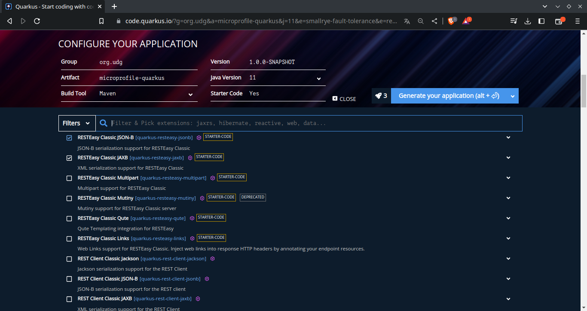
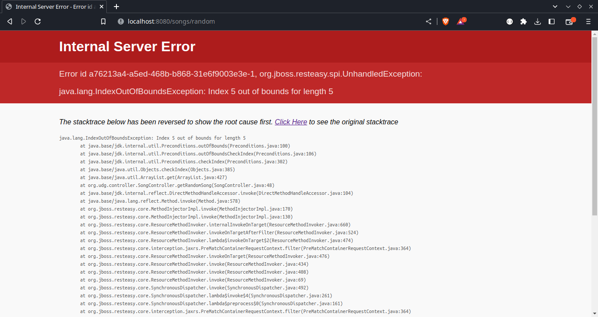
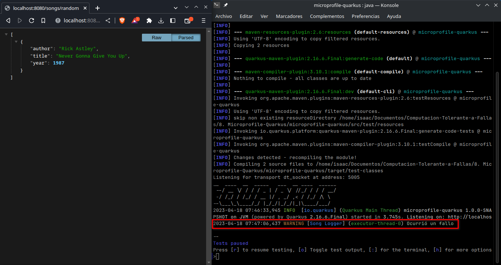
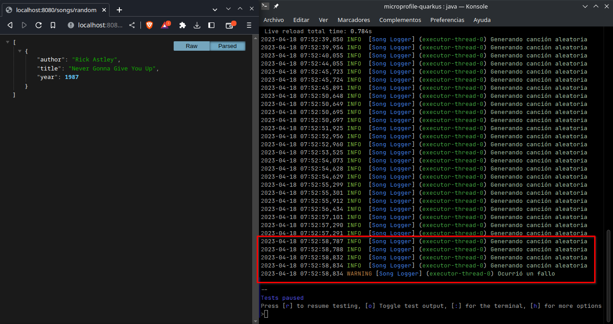
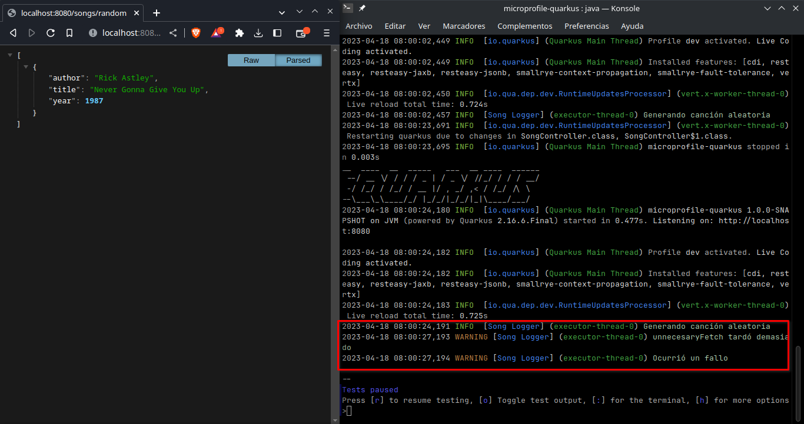
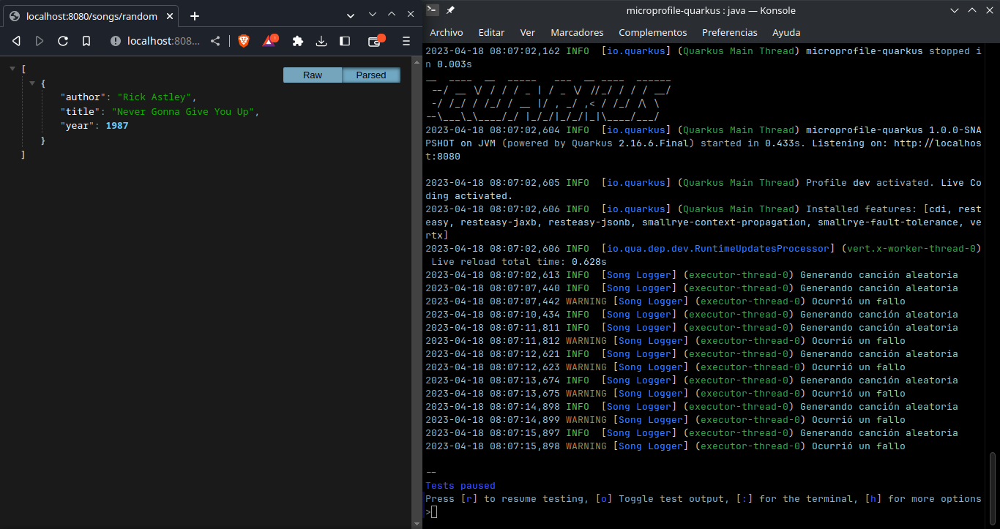
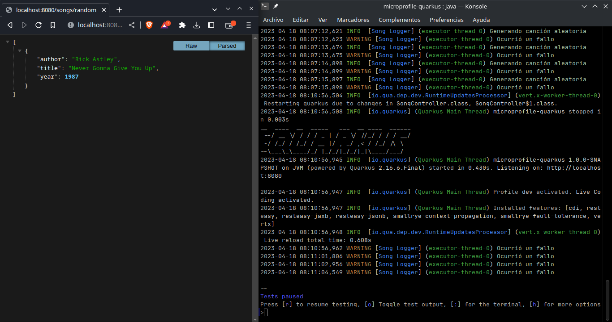

# MicroProfile-Quarkus
## **Universidad de Guadalajara** - Centro Universitario de Ciencias Exactas e Ingenierias

### Este es un proyecto realizado para la materia de Computación Tolerante a Fallas - D06

**Alumno:** Benavides Hernandez Isaac Alain

---
## Introducción
La popularización de los microservicios en la industria denotó varias necesidades dentro de este ecosistema, una de ellas era la tolerancia a fallas. Actualmente existen una gran variedad de herramientas para hacer una aplicación tolerante a fallas, como los contenedores y la orquestación de los mismos. Sin embargo, cuando estas herramientas no existian era necesario agregar la tolerancia a fallos a través de código. MicroProfile incluye una especificación de tolerancia a fallas implementada especialmente para Servicios Web y en esta practica conoceremos las principales utilidades de tolerancia a fallas de este framework.

---
## Investigación

### ¿Qué es Java EE?
Java Enterprise Edition o Java EE es una especificación de Java hecha por la comunidad en la que se proporciona, a parte de todas las funciones implementadas en Java SE se agrega soporte especial para ciertas aplicaciones en especifico con el ambito empresarial, por ejemplo proporciona servicios de gestión de transacciones, paralelismo, seguridad y acceso a bases de datos.

### ¿Qué es Java SE?
Java Standard Edition o Java SE es una especificación de Java en la que se proporciona una colección de herramientas para programar aplicaciones empresariales, de escritorio, etc.

### ¿Qué es Jakarta EE?
Jakarta EE es el nombre con el que se le conoce a Java EE hoy en dia, después de que Oracle comprara a Sun Microsystems y con ellos el proyecto del lenguaje de programación Java, en 2017 Oracle cedió los derechos de Java EE a la fundación Eclipse, sin embargo, "Java" es una marca registrada de la compañia Oracle, por lo que la fundación Eclipse decidió renombrar el proyecto a Jakarta EE.

### ¿Qué es MicroProfile?
MicroProfile es una especificación de librerias de Java EE o Jakarta EE (dependiendo la versión de Java) recopiladas especialmente para construir microservicios a través de multiples sistemas operativos.

### ¿Qué es Spring Boot?
Al igual que MicroProfile, Spring Boot es una herramienta que facilita el uso de librerias de Java para crear microservicios. Los proyectos creados en Spring Boot estan hechos para optimizar la codificación y no gastar tiempo configurando nuestro proyecto.

### ¿Qué es Quarkus?
Quarkus es un framework de Java especial para crear aplicaciones optimizadas para la nube, permite trabajar con una gran variedad de estandares como MicroProfile o Spring Boot y agregar funciones adicional, como la integración con Kubernetes.

### ¿Qué es Maven?
Apache Maven es una herramienta de gestión de dependencias, herramienta de compilación y de documentación. Esta herramienta esta hecha especialmente para trabajar con el lenguaje de programación Java y nacio como un remplazo moderno de la herramienta de construcción Apache Ant.

### ¿Qué es Gradle?
Gradle es al igual que Maven una herramienta para la compilación de proyectos de Java, y algunos otros lenguajes, en el cual tambien se cuenta con un gestor de dependencias. Gradle permite compilar proyectos rapidamente ya que utiliza compilaciones anteriores para optimizar tiempos.

---
## Contenido
Para inicializar un proyecto de MicroProfile con Quarkus tenemos que dirigirnos a la página web de Quarkus y seleccionamos las librerias que queramos utilizar, en este caso como es un ejemplo minimo utilizaremos solo las siguientes:
- RESTEasy Classic JSON-B   (Soporte para serialización JSON)
- RESTEasy Classic JAXB     (Soporte para endpoints REST)
- SmallRye Fault Tolerance  (Libreria para agregar tolerancia a fallas)

Una vez descargado el proyecto base que genera la página de Quarkus, debemos de adaptar el código a nuestras necesidades, este código de ejemplo utiliza una lista de la clase `Song`, la cual tiene unicamente 5 canciones, en el endpoint **/songs/random** es donde se puede provocar una falla, debido a que genera un número aleatorio del 0 al 9 y devolver ese indice de la lista, el cual puede no existir.

~~~java
package org.udg.controller;

import org.udg.model.Song;
import org.eclipse.microprofile.faulttolerance.*;

import javax.ws.rs.GET;
import javax.ws.rs.Path;
import java.util.ArrayList;
import java.util.List;
import java.util.Random;
import java.util.logging.Logger;

@Path("/songs")
public class SongController {
    List<Song> songList = new ArrayList<Song>(){{
        add(new Song("Daylight", "Joji", 2020));
        add(new Song("Say It Right", "Nelly Furtado", 2009));
        add(new Song("Lady", "Modjo", 2000));
        add(new Song("Sky's the Limit", "Notorious B.I.G.", 2006));
        add(new Song("Dancin", "Aaron Smith", 2014));
    }};
    Logger LOGGER = Logger.getLogger("Song Logger");
    
    
    @GET
    @Timeout(value = 3000L)
    @Retry(maxRetries = 3)
    @CircuitBreaker(failureRatio = 0.1, delay = 10000L)
    @Bulkhead(value = 1)
    @Fallback(fallbackMethod = "getSongFallback")
    public List<Song> getSongList() {
        return this.songList;
    }

    @GET
    @Timeout(value = 3000L)
    @Retry(maxRetries = 3)
    @CircuitBreaker(failureRatio = 0.1, delay = 10000L)
    @Bulkhead(value = 0)
    @Fallback(fallbackMethod = "getSongFallback")
    @Path("/random")
    public List<Song> getRandomSong() {
        LOGGER.info("Generando canción aleatoria");
        // unnecesaryFetch();
        Random rand = new Random();
        int num = rand.nextInt(10);
        
        return List.of(this.songList.get(num));
    }

    public List<Song> getSongFallback() {
        LOGGER.warning("Ocurrió un fallo");
        return List.of(new Song("Never Gonna Give You Up", "Rick Astley", 1987));
    }

    public void unnecesaryFetch() {
        try {
            Thread.sleep(5_000L);
        } catch (InterruptedException e) {
            LOGGER.warning("unnecesaryFetch tardó demasiado");
        }
    }
}
~~~

---
## Demostración
Para empezar con la demostración de la tolerancia a fallas de la aplicación desarrollada se ejecutarán diferentes escenarios para mostrar la capacidad de la aplicación a recuperarse de un error.

### 1. Aplicación sin métodos de tolerancia a fallas regresando un elemento random de la lista que no existe.

### 2. Aplicación con un fallback configurado
Como se puede observar, el logger nos indica que ocurrió un fallo, sin embargo, ahora no nos arroja un error, si no que nuestra función FallBack nos devuelve una canción predeterminada.

### 3. Aplicación con fallback y reintentos configurados
Como se puede observar en la terminal, en un muy corto periodo de tiempo se solicitó 4 veces la función para obtener una canción aleatoria, sin embargo, de estas peticiones nosotros solo realizamos la primera, las otras 3 fuerón hechas gracias al decorador `@Retry` y como se observa, si despues del numero de reintentos aún se sigue generando un fallo, nuestra aplicación utilizará el Fallback.

### 4. Aplicación con fallback y Timeout configurados
Si por alguna razón del destino, nuestro código tarda más del tiempo especificado en el decorador `@Timeout`, que en este caso se configuró timeout de 3 segundos y se invocó una función que espera 5 segundos para continuar, por lo que se provoca un fallo, y como podemos ver en la terminal, se solicita una canción aleatoria y 3 segundos despues nos marca el error y se utiliza el Fallback.

### 5. Aplicación con fallback y Circuit Breaker
Si se llega a superar una tasa de fallos en nuestra aplicación, podemos configurar un Circuit Breaker para que se redireccione hacia nuestro Fallback por una cantidad de tiempo especifica en lo que en teoria, nuestra aplicación se recupera, en este ejemplo, toma 15 segundos para "recuperarse", y como se puede apreciar en este tiempo todas las solicitudes nuevas son redireccionadas directamente hacia el Fallback.

### 6. Aplicación con fallback y Bulkhead
Si queremos limitar las solicitudes simultaneas que nuestra aplicación puede procesar, podemos utilizar el decorador `@Bulkhead` donde podemos especificar la cantidad de solicitudes simultaneas que el endpoint puede soportar, si se sobrepasa ese número, se redirige directamente al Fallback. Para poder ilustrar esto facilmente configure el Bulkhead en 0, por lo que el endpoint no procesa ninguna solicitud.

---
## Instalación
Para ejecutar el código tendrá que seguir los siguientes pasos:
1. Instalar OpenJDK (Recomiendo la versión 11).

2. Instalar Maven.

3. Clonar el repositorio
    ~~~bash
    git clone https://github.com/isaac-bh/Computacion-Tolerante-a-Fallas
    ~~~

4. Entrar a la carpeta del proyecto
    ~~~bash
    cd 'Computacion-Tolerante-a-Fallas/8. Microprofile-Quarkus/'
    ~~~

5. Ejecutar el siguiente comando para iniciar Quarkus en ambiente de desarrollo:
    ~~~bash
    mvn compile quarkus:dev
    ~~~

6. ¡A programar!

---
## Conclusión
Para concluir, el que existan dos formas actualmente de dar tolerancia a fallas a una aplicación empresarial es particularmente interesante, ya que una utiliza principalmente la infraestructura y poder de computo para dar tolerancia, mientras que la otra se utiliza a base de código, por lo que si nosotros tenemos pocos recursos de los que podemos disponer, el método de tolerancia a fallas visto en esta practica es más viable de utilizar. Nunca habia visto un servicio web tan robusto por si solo como el que construimos en esta practica. Desconozco si existen alternativas similares para otros lenguajes de programación pero es muy bueno conocer que podemos programar una API con este nivel de recuperación de errores.
